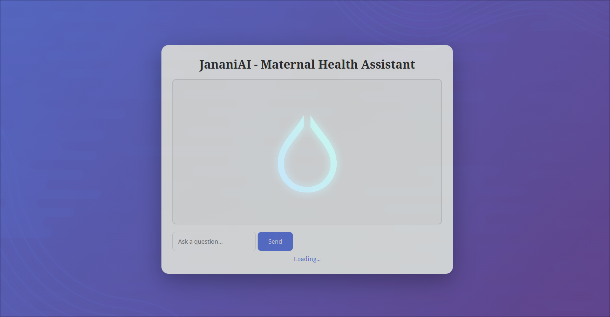

# :cherry_blossom: JananiAI - AI Maternal Health Companion :cherry_blossom: 
:stethoscope: We Heal You with Empathetic, Evidence-Informed Guidance :stethoscope:

> :baby: Still in Development, not Ready for Scale!! :baby:

# :books: Table of Contents :books:
 <ul>
    <li> <a href="#quick-start">Quick Start</a> </li>
    <li> <a href="#tech-stack">Tech Stack</a> </li>
</ul> 

# :rocket: Quick Start :rocket:

## Live Link

## Images - POC

## Animated - POC
demo imgs, animations, links, as columns aka tables
optimized assets

<a href="#table-of-contents">Back to Top</a>

# :book: Evaluation and Accuracy :book:

<a href="#table-of-contents">Back to Top</a>

# :gear: Tech Stack :gear:

| Technology | Icon |
|------------|------|
| HTML       |  |
| CSS        |  |
| JavaScript |  |
| FastAPI    |  |
| Supabase   |  |
| Gemini API |  |

<a href="#table-of-contents">Back to Top</a>

# :handshake: Contributing :handshake:

We welcome contributions! Please read our [contributing guidelines](./CONTRIBUTING.md) to get started on making contributions to the project.

<a href="#table-of-contents">Back to Top</a>

# :busts_in_silhouette: Contributors :busts_in_silhouette:
|  |  |
|--|--|
|   [Mofazzal Hosen](https://github.com/StealthSoldierM)|   [S. M. Fayez Ahmed](https://github.com/Fayez7075)|
|   [Nayem Hasan Bijoy](https://github.com/bijoy51)|   [Farhan Wahid](https://github.com/wahidfarhan)|
|   [Samia Akhand](https://github.com/sami800435)|

<a href="#table-of-contents">Back to Top</a>

# :scroll: License :scroll:

This project is licensed under the Apache License 2.0. See the [LICENSE](./LICENSE) file for more details.

<a href="#table-of-contents">Back to Top</a>
